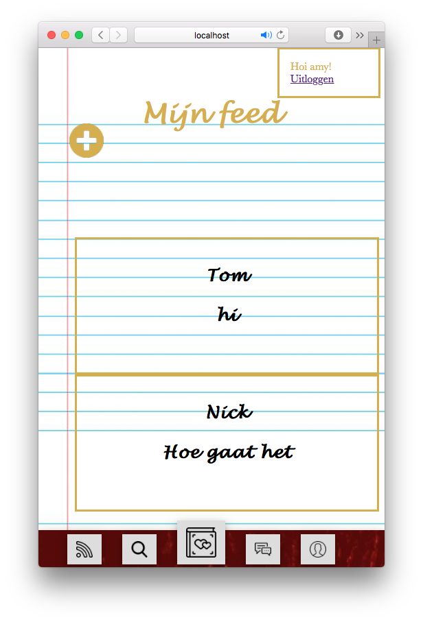
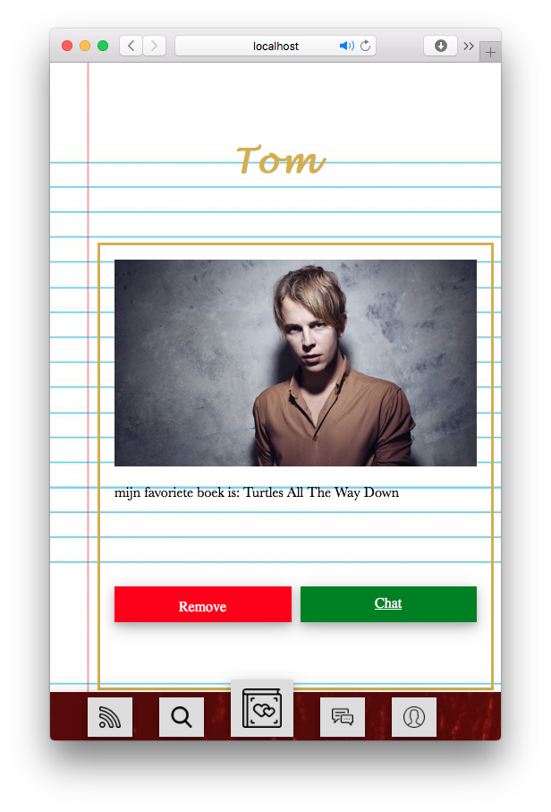

# Book a date

## over
```bash
Book a date is een dating web app die gebaseerd is op de mensen te koppelen die elkaar vinden door middel van hun liefde voor boeken. Door deze web app kunnen mensen elkaar vinden en zo een nieuw hoofdstuk van hun leven laten beginnen.
```
## 1. Before installing

* install [NodeJS](https://nodejs.org/en/download/)
* install [mysql](https://dev.mysql.com/)
* $ brew install mysql
* $ npm init -y
* $ npm install mysql dotenv
* $ npm install express
* $ npm install array-find
* $ npm install ejs
* $ npm install slug body-parser
* $ npm install multer
* $ npm install argon2
* $ npm install express-session

## 2. Install

``` bash
git clone https://github.com/Asprengers/be-assessment-2.git
cd be-assessment-2

```
## 3. Database setup

``` bash
1. Brew install mysql
2. Brew services start mysql
3. Mysql -u root -p (enter your password)
4. CREATE DATABASE IF NOT EXISTS matches;
5. USE matches;
6. CREATE TABLE `overzicht` (
  `id` int(11) NOT NULL AUTO_INCREMENT,
  `cover` text,
  `name` text,
  `bio` text,
  `book` text,
  PRIMARY KEY (`id`)
) ENGINE=InnoDB AUTO_INCREMENT=24 DEFAULT CHARSET=utf8;
7. CREATE TABLE `profiel` (
  `id` int(11) NOT NULL AUTO_INCREMENT,
  `gebruikersnaam` text,
  `hash` text,
  `email` text,
  `voornaam` text,
  `achternaam` text,
  `leeftijd` text,
  `minLeeftijd` text,
  `maxLeeftijd` text,
  `geslacht` text,
  `voorkeur` text,
  `profielfoto` text,
  `boek` text,
  `schrijfer` text,
  `quote` text,
  PRIMARY KEY (`id`)
) ENGINE=InnoDB AUTO_INCREMENT=40 DEFAULT CHARSET=utf8;
8. CREATE TABLE `chat` (
  `id` int(11) NOT NULL AUTO_INCREMENT,
  `Subject` text,
  `message` text,
  PRIMARY KEY (`id`)
) ENGINE=InnoDB AUTO_INCREMENT=31 DEFAULT CHARSET=utf8;
9. touch .env
10. echo "DB_HOST=yourhost
DB_USER=youruser
DB_NAME=namedatabase
DB_PASSWORD=mypassword
SESSION_SECRET=yoursecret" >> .env


```

## 4. Start
```bash
npm install
npm start
```

## 5. To list
```bash
[x] git npm database node are used
[x] user can sign up
[x] user can log in
[x] user can log out
[x] user can stay logged in through sessions
[x] files can be uploaded
[x] display profiles
[x] chat function
[x] add register to profile
[] add structure
[] code style is consistent
[] document the code
[] update css
[] edit function CRUD
[] match function (filteren. Een minimale filter is een filter op geslacht en voorkeur van het profiel. (ander.geslacht==mijn.voorkeurmv && ander.voorkeurmv==mijn.geslacht))
[] search function
[] display relations
```

## Screenshots



   

[MIT License](https://github.com/Asprengers/be-assessment-2/blob/master/licence.md)  © 2018 [Amy Sprengers](https://github.com/Asprengers)
